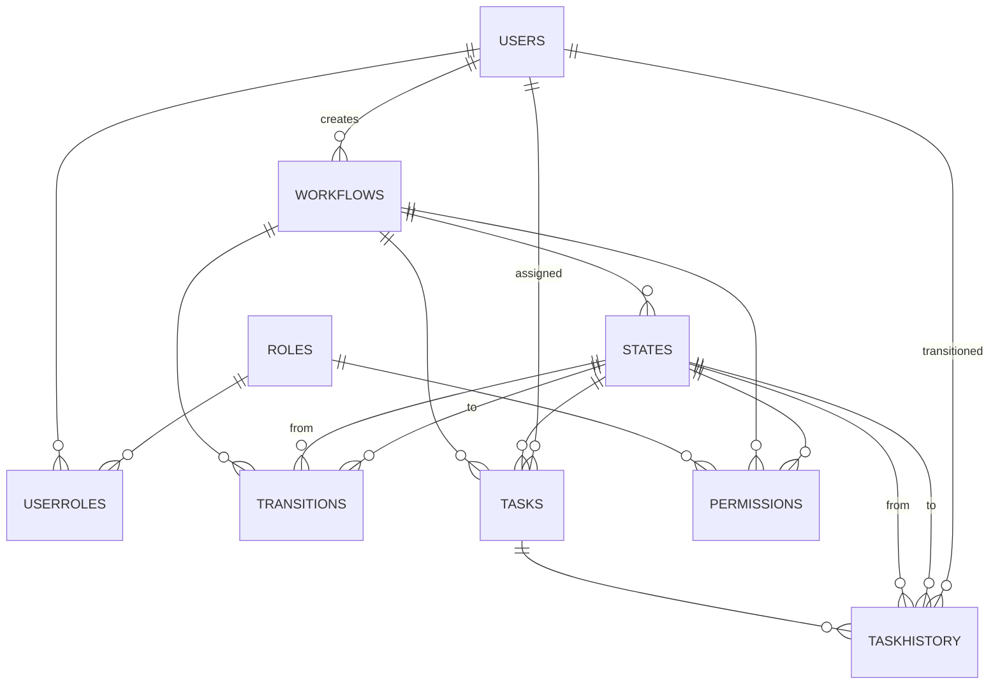

# High-Level Design (HLD) – Workflow Management System

## 1. Introduction
The Workflow Management System (WMS) is designed to model, automate, and track business workflows. It manages users, roles, workflow templates, tasks, state transitions, permissions, and history/audit logs.

---

## 2. Architecture Overview

- **Presentation Layer**  
  - Web UI/Portal for workflow design, task management, admin functions.
  - API endpoints for integration (RESTful or GraphQL).
- **Business Logic Layer**  
  - Controllers/services for workflow processing, state transitions, validation, and notifications.
  - Role- and permission-based access control.
- **Data Layer**  
  - SQL Server database hosting normalized tables as per ERD.
  - Entity Framework or ADO.NET as ORM/data access layer.

---

## 3. Core Modules & Components

### 3.1 User and Role Management
- CRUD for Users and Roles.
- Assign roles to users for access control.
- User authentication (password hash, status).
  
### 3.2 Workflow Designer & Engine
- CRUD for workflow templates (Workflows table).
- States and transitions definition per workflow.
- Workflow instance creation and management.

### 3.3 Task Management
- CRUD for Tasks (workflow steps assigned to users).
- Assignment/reassignment to users.
- Task data and status tracking.

### 3.4 State Transition Engine
- Enforces allowed transitions (Transitions table).
- Moves tasks through predefined states.
- Validates permissions for transitions.

### 3.5 Permission Management
- Role-based permissions on workflows and states.
- Granular control (create/read/update/delete).

### 3.6 Audit Trail & History
- Logs all state changes and actions (TaskHistory).
- Captures who transitioned, when, and comments.

---

## 4. Data Flow

1. **Workflow Creation:** Admins define workflow templates, states, and transitions.
2. **Task Creation:** New workflow instance creates tasks and assigns initial states.
3. **State Transition:** Task assignee or authorized user triggers state change via transition engine.
4. **Audit Logging:** Each transition/action is recorded in history/audit tables.
5. **Permission Enforcement:** All CRUD and transition actions are checked against permissions.

---

## 5. Integration & Extensibility

- **Notifications:** Email/SMS/push on task assignment, completion, or transition.
- **API Access:** REST/GraphQL endpoints for workflow/task operations.
- **Third-Party Integration:** Webhooks or connectors for external system triggers.
- **Custom Fields/Data:** Extensible task data via JSON fields.

---

## 6. Security Considerations

- Secure password storage (hashing/salting).
- Role-based access.
- Input validation/sanitization in UI and API.
- Audit trail for compliance.

---

## 7. Deployment & Scalability

- Can be deployed on-premise or cloud (Azure, AWS, etc.).
- Scalable horizontal (web/app nodes) and vertical (SQL Server scaling).
- Supports multi-tenancy with minor schema changes.

---

## 8. Diagrams

### 8.1 Entity Relationship Diagram

### 8.2 Component Diagram (Textual)

- **UI/Portal**
  - User Management
  - Workflow Designer
  - Task Dashboard
- **API/Service Layer**
  - Auth Service
  - Workflow Engine
  - Task Manager
  - Notification Service
- **Database**
  - Users, Roles, Workflows, States, Transitions, Tasks, History, Permissions

---

## 9. Future Enhancements

- BPMN/flowchart workflow design tools.
- SLA tracking and escalation rules.
- Analytics/dashboard for workflow metrics.
- Mobile app integration.

---

**End of HLD**
